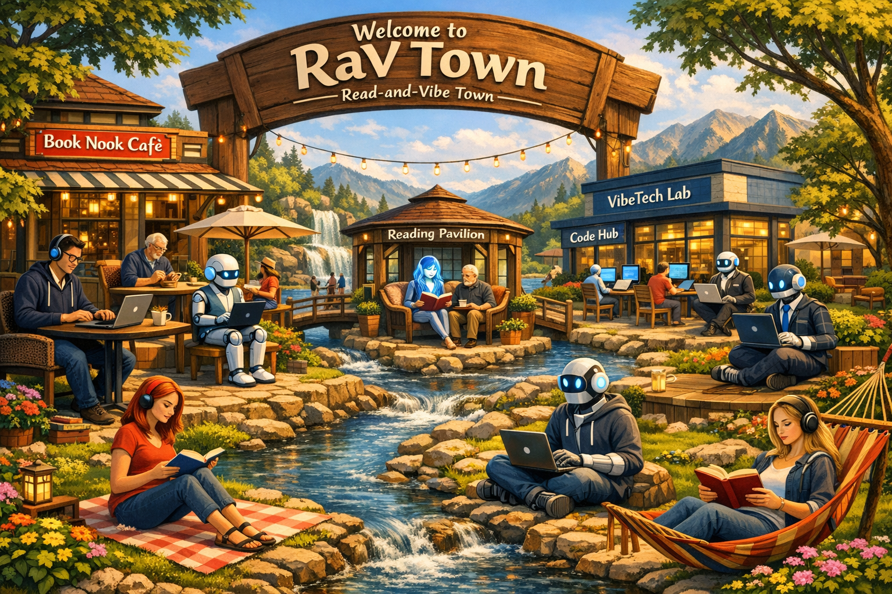

# RaV Town — Read-and-Vibe Town



A multi-agent orchestration system that autonomously implements features from Product Requirements Documents (PRDs). It coordinates parallel AI agents, each working in isolated git worktrees, to go from specification to merged pull request without human intervention.

## Quick Start

### 1. Create PRDs

Use the `/prd` skill to generate PRDs for each feature you want to build:

```
/prd Add a task priority system with high/medium/low levels
```

This creates `docs/prds/todo/prd-<date>-<feature>.md` for each feature. Repeat for as many features as you need.

### 2. Run Ravtown Mayor

Launch the orchestrator agent to implement all pending PRDs:

```bash
copilot --agent ravtown-mayor
```

Then prompt it with:

```
Complete all todo PRDs
```

The mayor takes it from there — preparing branches, launching parallel agents, and merging PRs until every PRD is done.

## How It Works

```
┌─────────────────────────────────────────────────────────────────┐
│                      Ravtown Mayor                               │
│  Scans PRDs → builds dependency graph → prepares branches        │
│  → launches agent waves                                          │
└────────┬────────────────────────────────────────────────────────┘
         │
         ├─ Ralph Agent #1 (port offset 10)
         │  ├─ creates worktree from prepared branch
         │  ├─ auto-runs /ralph-prd → converts PRD to JSON
         │  ├─ runs /ralph-loop → iterates through stories
         │  └─ creates PR → merges → archives PRD → signals PRD-COMPLETE
         │
         ├─ Ralph Agent #2 (port offset 20)
         │  └─ same flow for another independent feature
         │
         └─ Ralph Agent #3 (port offset 30)  [blocked]
            └─ waits for Agent #1 to finish (dependency)
```

### The Loop

Each Ralph agent runs a **loop** (`ralph.sh` via the `/ralph-loop` skill) that spawns a fresh AI coding session per iteration:

1. **Read PRD** — pick the highest-priority story where `passes: false`
2. **Implement** — make the code changes for that one story
3. **Quality check** — run typecheck, lint, tests
4. **Commit** — `feat: [US-001] - Story Title`
5. **Update PRD** — mark story as `passes: true`
6. **Log learnings** — append to progress file for future iterations
7. **Repeat** until all stories pass, then archive PRD, create & merge PR

## Components

### Agents (`/.github/agents/`)

| Agent | Role |
|---|---|
| [**ralph-agent**](.github/agents/ralph-agent.md) | Executes a single PRD end-to-end. Creates worktree from a prepared branch, auto-runs `/ralph-prd` to convert the PRD, runs `/ralph-loop` to implement stories. The loop handles archiving and PR creation. |
| [**ravtown-mayor**](.github/agents/ravtown-mayor.md) | Fleet manager. Scans `docs/prds/todo/` for PRD files, builds a dependency DAG, prepares isolated feature branches from HEAD, launches agents in parallel waves, cleans up on completion. |

### Skills (`/.github/skills/`)

Reusable capabilities that agents (or humans) can invoke:

| Skill | Purpose |
|---|---|
| [**prd**](.github/skills/prd/SKILL.md) | Generates a Product Requirements Document from a feature description. Asks clarifying questions, outputs structured markdown to `docs/prds/todo/`. |
| [**ralph-prd**](.github/skills/ralph-prd/SKILL.md) | Converts a markdown PRD into Ralph's `prd-<date>-<feature>.json` format. Ensures stories are right-sized (one iteration each), properly ordered, and have verifiable acceptance criteria. |
| [**ralph-loop**](.github/skills/ralph-loop/SKILL.md) | Runs the Ralph execution loop (`ralph.sh`). Iterates through PRD user stories, spawning a fresh AI session per iteration to implement, test, and commit each story. |
| [**dev-browser**](.github/skills/dev-browser/SKILL.md) | Browser automation via Playwright. Agents use this to visually verify UI changes — navigate pages, click elements, take screenshots. |

### Scripts (inside `/ralph-loop` skill)

| File | Purpose |
|---|---|
| [**ralph.sh**](.github/skills/ralph-loop/scripts/ralph.sh) | The core execution loop. Invokes an AI tool (Copilot, Claude, or AMP) repeatedly, injecting the PRD context each iteration. Handles port isolation and completion detection. |
| [**CLAUDE.md**](.github/skills/ralph-loop/scripts/CLAUDE.md) | The prompt template injected into each iteration. Tells the AI agent how to read the PRD, implement a story, run checks, commit, and log progress. |

### Prompts (`/.github/prompts/`)

| Prompt | Purpose |
|---|---|
| [**create-and-merge-pr**](.github/prompts/create-and-merge-pr.prompt.md) | Step-by-step guide for creating a PR, waiting for CI, and squash-merging to main. Used by agents at the end of a PRD. |

### Root Symlinks

| File | Target |
|---|---|
| `AGENTS.md` | → `.github/copilot-instructions.md` |
| `CLAUDE.md` | → `.github/copilot-instructions.md` |

These symlinks ensure that tools like GitHub Copilot, Claude Code, and other AI agents discover the project instructions regardless of which filename convention they look for.

## PRD Lifecycle

PRDs flow through three stages, tracked by directory location:

```
docs/prds/
├── todo/           ← PRDs waiting to be worked on
├── inprogress/     ← PRD currently being implemented (per branch)
└── complete/       ← Completed PRDs, organized by feature
    └── <feature-name>/
```

### Naming Convention

All PRD-related files use the pattern `<YYYY-MM-DD>-<feature-name>`:

| File Type | Pattern | Example |
|---|---|---|
| PRD markdown | `prd-<date>-<feature>.md` | `prd-2026-03-15-task-status.md` |
| PRD JSON | `prd-<date>-<feature>.json` | `prd-2026-03-15-task-status.json` |
| Progress file | `progress-<date>-<feature>.txt` | `progress-2026-03-15-task-status.txt` |
| Git branch | `ralph/<feature>` (no date) | `ralph/task-status` |

The date is set when the `/prd` skill first creates the PRD and carries through the entire lifecycle.

## Workflow: Feature → Merged PR

```
1. User describes a feature
        │
        ▼
2. /prd skill generates docs/prds/todo/prd-2026-03-15-feature.md
        │
        ▼
3. Ravtown Mayor discovers PRDs in docs/prds/todo/
        │
        ▼
4. Ravtown Mayor prepares branch from HEAD:
   ┌─────────────────────────────────────────┐
   │  Create branch ralph/<feature> from HEAD │
   │  Remove other PRDs from docs/prds/todo/  │
   │  Commit and push                         │
   └─────────────────────────────────────────┘
        │
        ▼
5. Ravtown Mayor launches Ralph Agent in background
        │
        ▼
6. Ralph Agent sets up:
   ┌─────────────────────────────────────────┐
   │  Create worktree from prepared branch    │
   │  Move PRD: todo/ → inprogress/           │
   │  Auto-run /ralph-prd → creates JSON      │
   └─────────────────────────────────────────┘
        │
        ▼
7. Ralph Agent runs /ralph-loop:
   ┌─────────────────────────────────────────┐
   │  Iteration 1: US-001 (schema)           │
   │  Iteration 2: US-002 (backend)          │
   │  Iteration 3: US-003 (UI)              │
   │  Iteration 4: US-004 (filters)          │
   │  Iteration 5: All pass → archive PRD    │
   │               → create & merge PR       │
   └─────────────────────────────────────────┘
        │
        ▼
8. PR auto-merges to main (includes archived PRD)
        │
        ▼
9. Ravtown Mayor cleans up worktree, launches next wave
```

## Port Isolation

When multiple agents run in parallel, each gets a unique port offset to prevent collisions:

| Agent | Offset | API Port | Web Port |
|---|---|---|---|
| Agent 1 | 10 | 3011 | 3010 |
| Agent 2 | 20 | 3021 | 3020 |
| Agent 3 | 30 | 3031 | 3030 |

## PRD Format

Ralph PRDs are JSON files with this structure:

```json
{
  "project": "MyProject",
  "branchName": "ralph/feature-name",
  "description": "Feature description",
  "dependsOn": [],
  "userStories": [
    {
      "id": "US-001",
      "title": "Story title",
      "description": "As a user, I want X so that Y",
      "acceptanceCriteria": ["Criterion 1", "Typecheck passes"],
      "priority": 1,
      "passes": false,
      "notes": ""
    }
  ]
}
```

Key rules:
- Each story must be completable in **one iteration** (one AI context window)
- Stories are ordered by dependency (schema → backend → UI)
- Every story needs `"Typecheck passes"` as a criterion
- UI stories need `"Verify in browser using dev-browser skill"`

## Manual / Single Feature

If you prefer to run a single feature manually:

```bash
.github/skills/ralph-loop/scripts/ralph.sh \
  --prd docs/prds/inprogress/prd-2026-03-15-feature.json \
  --tool copilot \
  10
```

## Adopting RaV Town in Your Project

1. **Copy this repo's structure** into your project:
   ```
   .github/agents/
   .github/skills/
   .github/prompts/
   docs/prds/todo/
   docs/prds/inprogress/
   docs/prds/complete/
   AGENTS.md → .github/copilot-instructions.md
   CLAUDE.md → .github/copilot-instructions.md
   ```

2. **Fill in `.github/copilot-instructions.md`** with your project's tech stack, commands, and architecture

3. **Create PRDs** using the `/prd` skill

4. **Run** `copilot --agent ravtown-mayor` and prompt: "Complete all todo PRDs"

## Supported AI Tools

Ralph supports three AI backends via `--tool`:

| Tool | Command | Flag |
|---|---|---|
| **GitHub Copilot CLI** | `copilot` | `--tool copilot` (default) |
| **Claude Code** | `claude` | `--tool claude` |
| **AMP** | `amp` | `--tool amp` |

## License

MIT
